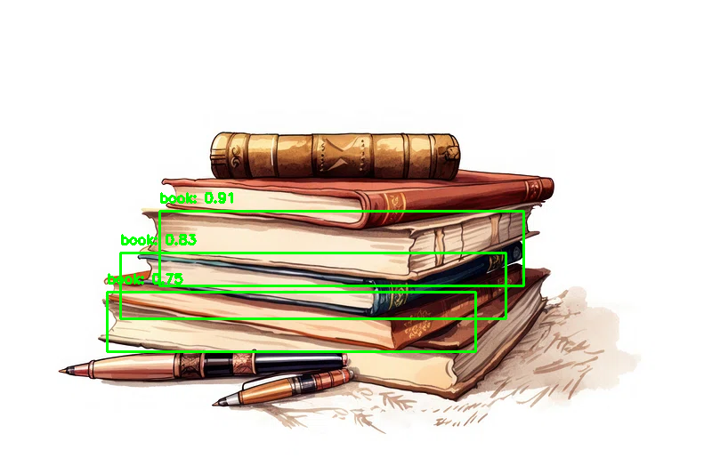

# Visual Object Classification & Deep Learning Inference Pipeline

An independent Machine Learning and Computer Vision engineering framework built in **PyTorch** and **OpenCV** to automate image preprocessing, feature localization, and downstream deep learning inference execution.

## 🚀 Technical Architecture Highlights
* **Automated Image Preprocessing Matrix**: Utilizes OpenCV to ingest directory-level data streams, seamlessly scaling, normalizing, and handling matrix transformations (including RGBA alpha-channel alpha blending binarization).
* **Deep Learning Inference Pipeline**: Plugs directly into a pre-trained Faster R-CNN ResNet-50 deep neural network (DNN) engine via PyTorch to execute real-time object classification and bounding box localization.
* **Throughput Optimization**: Implements vector-based **Non-Maximum Suppression (NMS)** via `torchvision.ops` to eliminate overlapping bounding boxes and minimize redundant prediction matrix latency.

## 📦 Project Directory Structure
```text
object_classification_pipeline/
├── classifier_pipeline.py    # Core ML Inference Script
├── input_images/             # Raw Directory Input Signals
└── output_results/           # Localized Object Bounding Box Outputs

🛠️ Local Execution
Ensure your local deep learning dependencies are fully provisioned, then execute the structured batch execution matrix:
python classifier_pipeline.py

## 📊 Evaluation & Verification Metrics
### Batch Inference Output Matrix
Below is the execution output displaying localized object classification boundaries and high-confidence tracking markers:


